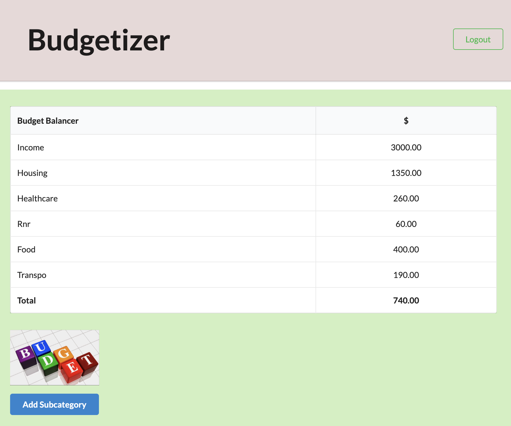
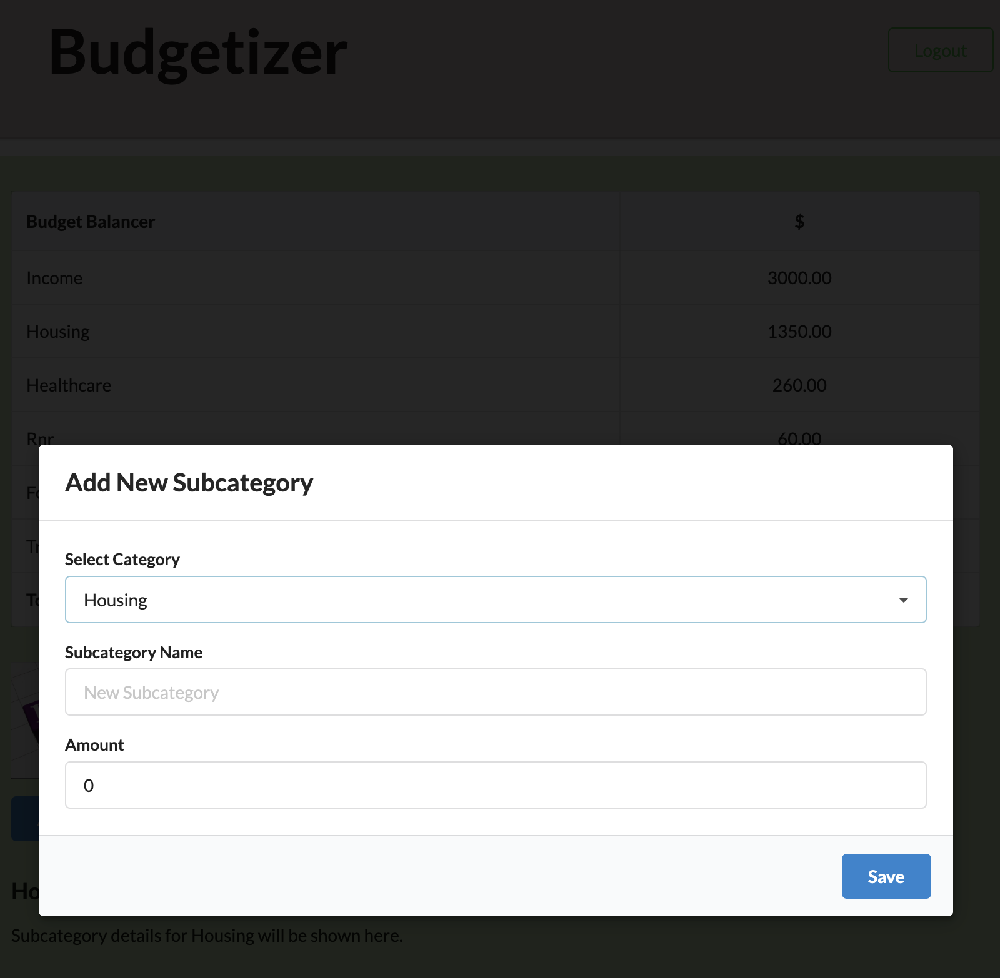

# 💰 Budgetizer 💰

Budgetizer is a responsive MERN stack single-page application (SPA) that helps users organize and track their budget across essential life categories such as Income, Housing, Healthcare, Recreation, Food, and Transportation. With secure authentication, interactive budget inputs, and dynamic UI updates, Budgetizer supports financial awareness and accountability.

## 🚀 Live Deployment

👉 [Deployed Application on Render](https://budgetizer-b0og.onrender.com)

## 📂 Repository

🔗 [GitHub Repository](https://github.com/MTS-sip/Budgetizer.git)

## 🗄️ Table of Contents

- Usage & Testing
- Screenshots
- License
- Technologies
- Installation
- Features
- Contributors
- User Story
- Acceptance Criteria Checklist
- Contact

## 🚀 Usage & Testing

#### Using Budgetizer

1. Sign Up or Log In

- Create an account to start managing your budget. Authentication is handled using JWT and your session is stored securely in `localStorage`.

2. Track Your Budget

Once logged in, you’ll be able to:

- View current totals for key budget categories
- Add subcategories (e.g., Rent under Housing) with custom amounts
- Automatically see updates to category totals and the overall running total

3. Responsive & Interactive

The interface adapts to different screen sizes and includes smooth user interactions such as modals, dropdowns, and animations.

#### Testing the App

While this version of **Budgetizer** does not include a formal testing framework, it has been tested manually to ensure functionality across key use cases:

| Feature                      | Tested | Notes                            |
| ---------------------------- | ------ | -------------------------------- |
| User Signup/Login            | ✅     | Validates and stores JWT         |
| GraphQL Queries/Mutations    | ✅     | Uses Apollo Client successfully  |
| Budget Display & Calculation | ✅     | Totals update dynamically        |
| Subcategory Addition         | ✅     | Modal input with validation      |
| Authentication Redirect      | ✅     | Unauthorized users are rerouted  |
| Responsiveness on Mobile     | ✅     | Semantic UI adapts automatically |

#### Pro Tip

To quickly test login, use the seed credentials (if seeded):

`Username: SlapHappy`
`Password: password` 

`Username: ScarletKnight`
`Password: April23`

## 📸 Screenshots

## 📋 License

MIT License

Copyright (c) 2025 LDegraz, MTS-sip, & bjaegerthomas

Permission is hereby granted, free of charge, to any person obtaining a copy
of this software and associated documentation files (the "Software"), to deal
in the Software without restriction, including without limitation the rights
to use, copy, modify, merge, publish, distribute, sublicense, and/or sell
copies of the Software, and to permit persons to whom the Software is
furnished to do so, subject to the following conditions:

The above copyright notice and this permission notice shall be included in all
copies or substantial portions of the Software.

THE SOFTWARE IS PROVIDED "AS IS", WITHOUT WARRANTY OF ANY KIND, EXPRESS OR
IMPLIED, INCLUDING BUT NOT LIMITED TO THE WARRANTIES OF MERCHANTABILITY,
FITNESS FOR A PARTICULAR PURPOSE AND NONINFRINGEMENT. IN NO EVENT SHALL THE
AUTHORS OR COPYRIGHT HOLDERS BE LIABLE FOR ANY CLAIM, DAMAGES OR OTHER
LIABILITY, WHETHER IN AN ACTION OF CONTRACT, TORT OR OTHERWISE, ARISING FROM,
OUT OF OR IN CONNECTION WITH THE SOFTWARE OR THE USE OR OTHER DEALINGS IN THE
SOFTWARE.

## ⚙️ Technologies

- **VS Code**: [VSC IDE](https://code.visualstudio.com/) 
- **Semantic UI**: 
- **Render**: [Cloud Application Platform Render](https://render.com/) 
- **GitHub**: [Github](https://github.com/) 
- **Vite**: [ Front end Build Tool for the Web](https://vite.dev/) 
- **Typescript**: [JavaScript w/syntax for types ](https://www.w3schools.com/typescript/typescript_intro.php) 
- **npm**: [Package manager for js](https://www.npmjs.com/) 
- **CoPilot**: [Copilot for GitHub](https://github.com/features/copilot?ef_id=_k_Cj0KCQjw4v6-BhDuARIsALprm30F26jOBa_tX-MdbRzSHmPNFiQCmfhZXt1XYobPc8mf7E3NM44SAmQaAipREALw_wcB_k_&OCID=AIDcmmb150vbv1_SEM__k_Cj0KCQjw4v6-BhDuARIsALprm30F26jOBa_tX-MdbRzSHmPNFiQCmfhZXt1XYobPc8mf7E3NM44SAmQaAipREALw_wcB_k_&gad_source=1&gclid=Cj0KCQjw4v6-BhDuARIsALprm30F26jOBa_tX-MdbRzSHmPNFiQCmfhZXt1XYobPc8mf7E3NM44SAmQaAipREALw_wcB) 
- **HTML**: [Standard Markup language for Web pages](https://www.w3schools.com/html/) 
- **CSS**: [Stylizing for the Web](https://www.w3schools.com/css/) 
- **Dev Tools**

## 🛠️ Installation

To run **Budgetizer** locally, follow these steps:

1. Clone the repository
   `git clone git@github.com:MTS-sip/Budgetizer.git` 
   `cd Budgetizer`

2. Install dependencies

This command installs both client and server dependencies:

`npm run install`

3. Create an .env file in the server directory and add your environment variables:

`MONGODB_URI=your-mongodb-connection-string`

`JWT_SECRET_KEY=your-secret-key`

4. Seed the database (optional but recommended for demo data)

`npm run seed`

5. Start the development server

This will run both the client and server concurrently:

`npm run start:dev`

6. Open the app

Navigate to [http://localhost:3030 ](http://localhost:3030/)in your browser to start using Budgetizer.

- Make sure MongoDB is running locally or you’re connected to MongoDB Atlas.

## 🔦 Features

- 🔐 User Authentication with JWT
- 📊 Visual budget breakdown by category and subcategory
- ➕ Ability to add custom subcategories
- 🔁 Dynamic updating of totals
- 📱 Fully responsive design
- 💡 Smooth user experience with modals and dropdowns
- 🔎 Apollo Client for GraphQL queries and mutations
- 🧪 GitHub Actions included for CI

## 🤝 Contributors

- **Ben Jaeger-Thomas**: Developer
- **Michael Scipio**: Developer
- **Lauren DeGrazia**: Developer
- **Lesley Vaden**: T.A., providing guidance and support throughout the project.
- **Kevin Ferguson**: Instructor, providing guidance and support throughout the project.
- **ChatGPT & Xpert Learning Assistant chat+**: Answering questions regarding code development for the project.
- **BCS (Bootcamp Spot)**: Lessons Activities Code

## 🧠 User Story

**AS AN** individual trying to manage my personal finances,

**I WANT** an easy-to-use budgeting app that lets me log transactions & see my spending habits,

**SO THAT** I can stay on top of my expenses & make better financial decisions.

## ✅ Acceptance Criteria Checklist

- [x] Uses React for frontend
- [x] GraphQL with Node.js, Express.js
- [x] MongoDB and Mongoose ODM
- [x] Queries and mutations for all data operations
- [x] Deployed to Render with live data
- [x] Includes at least one GitHub Action
- [x] Clean UI & responsive design
- [x] JWT authentication implemented
- [x] API key protection and environment variables
- [x] High-quality README

## 📬 Contact

If you have any questions, please feel free to reachout!

- **Lauren DeGrazia**: [Email](mailto:degrazial1@yahoo.com) or [Github](https://github.com/LDegraz)
- **Michael Scipio**: [Email](mailto:scipiomichael@gmail.com) or [Github](https://github.com/MTS-sip)
- **Ben Jaeger-Thomas**: [Email](mailto:Bjaegerthomas@gmail.com) or [Github](https://github.com/bjaegerthomas)

#### How to Contact

You can contact us via email for any inquiries or feedback regarding this project. Alternatively, you can open an issue on [GitHub](https://github.com/MTS-sip/Budgetizer.git) if you encounter any problems or have suggestions for improvements. We will do our best to respond promptly!
